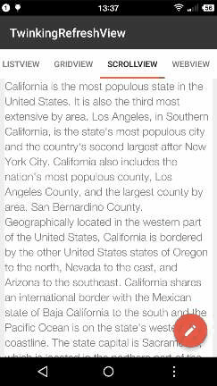

# TwinklingRefreshLayout

TwinklingRefreshLayout延伸了Google的SwipeRefreshLayout的思想,不在列表控件上动刀,而是使用一个ViewGroup来包含列表控件,以保持其较低的耦合性和较高的通用性。其主要特性有：

1. 支持RecyclerView、ScrollView、AbsListView系列(ListView、GridView)、WebView以及其它可以获取到scrollY的控件
2. 支持加载更多
3. 默认支持 **越界回弹**
4. 可开启没有刷新控件的纯净越界回弹模式
5. setOnRefreshListener中拥有大量可以回调的方法
6. 将Header和Footer抽象成了接口,并回调了滑动过程中的系数,方便实现个性化的Header和Footer

## Demo
[下载Demo](art/app-debug.apk)

        

## 使用方法
#### 1.添加gradle依赖
将libray模块复制到项目中,或者直接在build.gradle中依赖:
```
compile 'com.lcodecorex:tkrefreshlayout:1.0.2'
```

#### 2.在xml中添加TwinklingRefreshLayout
```xml
<?xml version="1.0" encoding="utf-8"?>
<com.lcodecore.library.TwinklingRefreshLayout xmlns:android="http://schemas.android.com/apk/res/android"
    xmlns:app="http://schemas.android.com/apk/res-auto"
    android:id="@+id/refreshLayout"
    android:layout_width="match_parent"
    android:layout_height="match_parent"
    app:tr_wave_height="180dp"
    app:tr_head_height="100dp">

    <android.support.v7.widget.RecyclerView
        android:id="@+id/recyclerview"
        android:layout_width="match_parent"
        android:layout_height="match_parent"
        android:background="#fff" />
</com.lcodecore.library.TwinklingRefreshLayout>
```

#### 3.在Activity或者Fragment中配置
##### TwinklingRefreshLayout不会自动结束刷新或者加载更多，需要手动控制
```java
refreshLayout.setOnRefreshListener(new TwinklingRefreshLayout.OnRefreshListener(){
            @Override
            public void onRefresh(final TwinklingRefreshLayout refreshLayout) {
                new Handler().postDelayed(new Runnable() {
                    @Override
                    public void run() {
                        refreshLayout.finishRefreshing();
                    }
                },2000);
            }

            @Override
            public void onLoadMore(final TwinklingRefreshLayout refreshLayout) {
                new Handler().postDelayed(new Runnable() {
                    @Override
                    public void run() {
                        refreshLayout.finishLoadmore();
                    }
                },2000);
            }
        });
    }
```
使用finishRefreshing()方法结束刷新，finishLoadmore()方法结束加载更多。此处OnRefreshListener还有其它方法，可以选择需要的来重写。

##### setWaveHeight、setHeaderHeight、setBottomHeight
- setWaveHeight 设置头部可拉伸的最大高度。
- setHeaderHeight 头部固定高度(在此高度上显示刷新状态)
- setBottomHeight 底部高度

##### setHeaderView(IHeaderView headerView)、setBottomView(IBottomView bottomView)
设置头部/底部个性化刷新效果，头部需要实现IHeaderView，底部需要实现IBottomView。

##### setEnableOverlayRefreshView()
是否允许在越界的时候显示刷新控件，默认是允许的，也就是Fling越界的时候Header或Footer照常显示，反之就是不显示；可能有特殊的情况，刷新控件会影响显示体验才设立了这个状态。

##### setPureScrollModeOn()
开启纯净的越界回弹模式，也就是所有刷新相关的View都不显示，只显示越界回弹效果

#### 4.几个属性
- tr_wave_height 头部拉伸允许的最大高度
- tr_head_height  头部高度
- tr_bottom_height 底部高度

将考虑添加更多的属性，比如可以在xml中设置header或者footer的布局。


## 其它说明
### 1.默认支持越界回弹
这一点很多类似SwipeRefreshLayout的刷新控件都没有做到(包括SwipeRefreshLayout),因为没有拦截下来的时间会传递给列表控件，而列表控件的滚动状态很难获取。解决方案就是给列表控件设置了OnTouchListener并把事件交给GestureDetector处理,然后在列表控件的OnScrollListener中监听View是否滚动到了顶部(没有OnScrollListener的则采用延时监听策略)。

### 2.setOnRefreshListener大量可以回调的方法
- onPullingDown(TwinklingRefreshLayout refreshLayout, float fraction)  正在下拉的过程
- onPullingUp(TwinklingRefreshLayout refreshLayout, float fraction)    正在上拉的过程
- onPullDownReleasing(TwinklingRefreshLayout refreshLayout, float fraction)  下拉释放过程
- onPullUpReleasing(TwinklingRefreshLayout refreshLayout, float fraction)  上拉释放过程
- onRefresh(TwinklingRefreshLayout refreshLayout)  正在刷新
- onLoadMore(TwinklingRefreshLayout refreshLayout)  正在加载更多

其中fraction表示当前下拉的距离与Header高度的比值(或者当前上拉距离与Footer高度的比值)。

### 3.Header和Footer
目前已实现的Header有**BezierLayout**(图一)，**GoogleDotView**(图二)，**SinaRefreshView**(图三)；实现的Footer有 **BottomProgressView**(图一)，**LoadingView**(图三)，更多动效可以参考[AVLoadingIndicatorView](https://github.com/81813780/AVLoadingIndicatorView)库。

其中第一幅图源于[BeautifulRefreshForGirl](https://github.com/android-cjj/BeautifulRefreshLayout/tree/BeautifulRefreshForGirl)，原来的动效只支持21以上版本，且滑动过程中会出现View消失的情况，笔者做了一些优化并使其可以正常的在界面中使用。

### 3.实现个性化的Header和Footer
相关接口分别为IHeaderView和IBottomView,代码如下:
```java
public interface IHeaderView {
    View getView();

    void onPullingDown(float fraction,float maxHeadHeight,float headHeight);

    void onPullReleasing(float fraction,float maxHeadHeight,float headHeight);

    void startAnim(float maxHeadHeight,float headHeight);
}
```

其中getView()方法用于在TwinklingRefreshLayout中获取到实际的Header,因此不能返回null。

**实现像新浪微博那样的刷新效果**,实现代码如下:

1.首先定义SinaRefreshHeader继承自FrameLayout并实现IHeaderView方法

2.getView()方法中返回this

3.在onAttachedToWindow()方法中获取一下需要用到的布局

```java
@Override
    protected void onAttachedToWindow() {
        super.onAttachedToWindow();

        if (rootView == null) {
            rootView = View.inflate(getContext(), R.layout.view_sinaheader, null);
            refreshArrow = (ImageView) rootView.findViewById(R.id.iv_arrow);
            refreshTextView = (TextView) rootView.findViewById(R.id.tv);
            loadingView = (ImageView) rootView.findViewById(R.id.iv_loading);
            addView(rootView);
        }
    }
```

4.实现其它方法
```java
@Override
    public void onPullingDown(float fraction, float maxHeadHeight, float headHeight) {
        if (fraction < 1f) refreshTextView.setText(pullDownStr);
        if (fraction > 1f) refreshTextView.setText(releaseRefreshStr);
        refreshArrow.setRotation(fraction * headHeight / maxHeadHeight * 180);


    }

    @Override
    public void onPullReleasing(float fraction, float maxHeadHeight, float headHeight) {
        if (fraction < 1f) {
            refreshTextView.setText(pullDownStr);
            refreshArrow.setRotation(fraction * headHeight / maxHeadHeight * 180);
            if (refreshArrow.getVisibility() == GONE) {
                refreshArrow.setVisibility(VISIBLE);
                loadingView.setVisibility(GONE);
            }
        }
    }

    @Override
    public void startAnim(float maxHeadHeight, float headHeight) {
        refreshTextView.setText(refreshingStr);
        refreshArrow.setVisibility(GONE);
        loadingView.setVisibility(VISIBLE);
    }
```

5.布局文件
```xml
<?xml version="1.0" encoding="utf-8"?>
<LinearLayout xmlns:android="http://schemas.android.com/apk/res/android"
    android:orientation="horizontal" android:layout_width="match_parent"
    android:layout_height="match_parent"
    android:gravity="center">
    <ImageView
        android:id="@+id/iv_arrow"
        android:layout_width="wrap_content"
        android:layout_height="wrap_content"
        android:src="@drawable/ic_arrow"/>

    <ImageView
        android:id="@+id/iv_loading"
        android:visibility="gone"
        android:layout_width="34dp"
        android:layout_height="34dp"
        android:src="@drawable/anim_loading_view"/>

    <TextView
        android:id="@+id/tv"
        android:layout_width="wrap_content"
        android:layout_height="wrap_content"
        android:layout_marginLeft="16dp"
        android:textSize="16sp"
        android:text="下拉刷新"/>
</LinearLayout>
```

注意fraction的使用,比如上面的代码`refreshArrow.setRotation(fraction * headHeight / maxHeadHeight * 180)`，`fraction * headHeight`表示当前头部滑动的距离，然后算出它和最大高度的比例，然后乘以180，可以使得在滑动到最大距离时Arrow恰好能旋转180度。


onPullingDown/onPullingUp表示正在下拉/正在上拉的过程。
onPullReleasing表示向上拉/下拉释放时回调的状态。
startAnim则是在onRefresh/onLoadMore之后才会回调的过程（此处是显示了加载中的小菊花）

如上所示，轻而易举就可以实现一个个性化的Header或者Footer。（更简单的实现请参考Demo中的 **TextHeaderView(图四)**）。


## 剩余问题
- Header或者Footer快速滚动时出现界面上残留有加载视图,解决方案有待优化（目前是通过设置LayoutParams.height=0的方式解决）。
- 优化一下自定义的加载动效。
- 优化代码质量。
- 制作一个star相关的动效。
- 对回弹效果做一下优化，比如支持使用不同的插值器
- 带视差效果的Header
